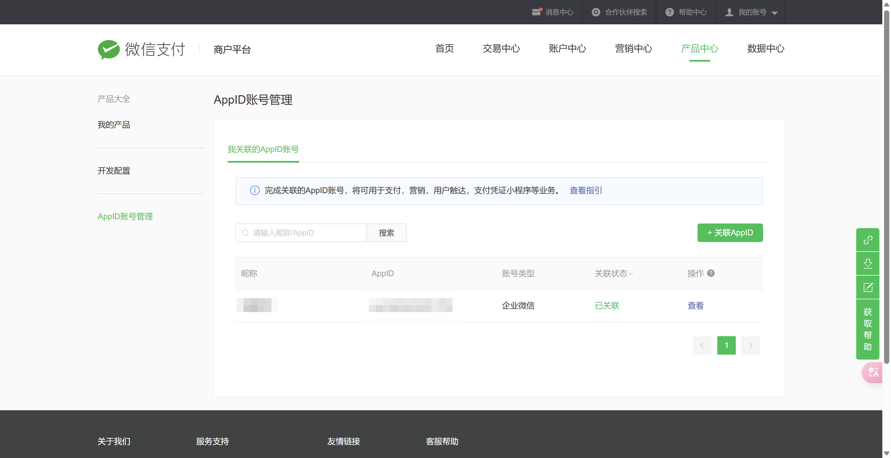

# 微信支付模板项目
> 项目开发时遇到的一个场景，业余时间用模板项目的方式记录一下。

## 项目介绍

1. 本项目是一个微信支付的模板项目，使用java做为后端服务，实现Native的微信支付。  
2. 项目使用了SpringBoot框架，集成了Swagger接口文档，方便调试。  
3. 项目中只写了三个接口：获取支付二维码、查询订单、退款。  

项目只实现了Native支付的部分功能。


### Native支付的完整流程

官方文档描述的比较清楚，我这里也做一下介绍，Native支付的完整流程：  
1、商户下单获取订单的二维码链接code_url，将code_url转换为二维码图片展示给用户。  
2、用户使用微信“扫一扫”进行扫码（不支持通过相册识别或长按识别二维码的方式完成支付）。  
3、扫码进入到微信的支付确认界面，用户可在该页面确认收款方和金额。  
4、用户确认订单收款方和金额无误后，点击“立即支付”会出现验密界面(验证密码或指纹等)，同时在该页面也可选择支付方式(零钱或银行卡等)。  
5、验密付款成功后，微信会展示支付成功页面。  
6、支付成功后，用户在微信支付-我的账单-账单明细中查看账单。  

### 技术栈、组件包、文档

- java版本：17  
- 微信支付版本：v3  
- 微信支付官方API文档：https://wechatpay-apiv3.github.io/api/v3/  
- 微信支付官方java文档：https://github.com/wechatpay-apiv3/wechatpay-java  
- 微信支付官方java文档：https://pay.weixin.qq.com/doc/v3/merchant/4012076506  

- swagger接口文档：http://**/swagger-ui/index.html
- 微信支付postman前置脚本：https://pay.weixin.qq.com/doc/v3/merchant/4012076519


## 配置说明
> application.properties 前五行微信支付相关配置需要自行配置
> 
> 包含：商户号、商户API证书序列号、商户API证书私钥、APIv3密钥、APPID

### 获取商户号

商户号是商户在微信支付的唯一标识，用于在微信支付系统中区分商户的身份。  
如果没有微信商户，可以注册微信支付商户 https://pay.weixin.qq.com/index.php/apply/applyment_home/guide_normal  
登录微信支付平台，进入账户中心可以查看商户号。（登陆账号）


### 获取商户API证书、证书序列号

官方提供了完整的文档：https://pay.weixin.qq.com/doc/v3/merchant/4013053053  
获取到证书后，将apiclient_key.pem放入到项目的resources文件夹下。  

### APIv3 密钥

官方提供了完整的文档：https://pay.weixin.qq.com/doc/v3/merchant/4013053267

### 获取APPID

通过微信支付商户平台关联APPID。  
支持已通过微信认证的服务号、政府或媒体类订阅号、小程序、企业微信、移动应用。  
官方文档：https://kf.qq.com/faq/181105JJNbmm181105eUZfee.html
   

## 项目启动

```shell
git clone git@github.com:guoshunfa/template-wechat-pay-java.git
```

[调整application.properties配置](#配置说明)

## 其他

后续会继续完善其他支付方式的接口。（我有项目场景或者项目有100star的话）